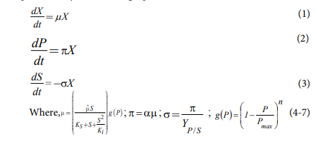
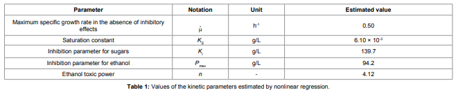
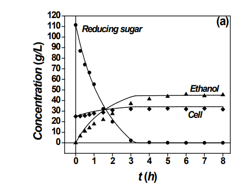
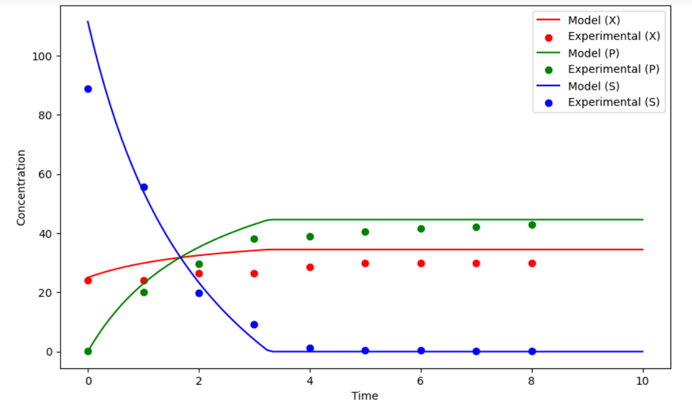
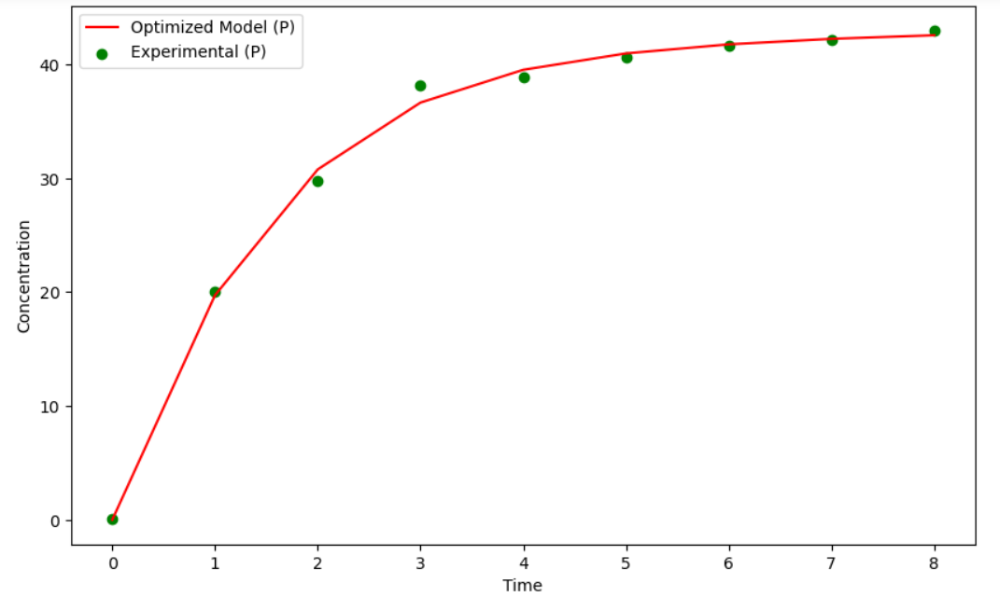
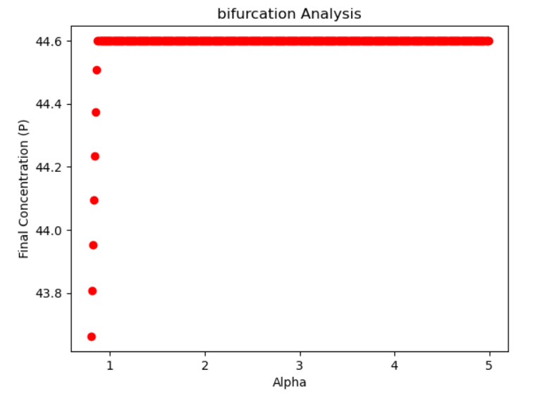
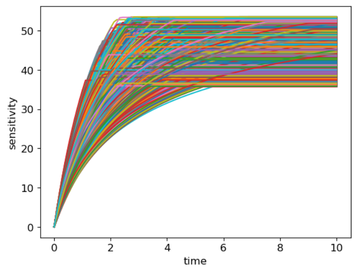

# Kinetic Modeling and Optimization of a Batch Ethanol Fermentation Process
### Samuel C Oliveira1*, Romulo C Oliveira2, Mariana V Tacin2 and Edwil AL Gattás2
This project aimed to replicate, and perhaps improve, the model developed in the above paper. The paper explores substrate limitation and inhibition by both the product ethanol and the substrate. Personal interest in this subject comes from the rising demand for fuel ethanol calls higher production and more efficient bioprocesses.The simplest models formulated to describe bioprocesses are the unstructured models. In these models, it is assumed that cellsare entities in solution that interact with the environment. Nointernal cell structure is recognized, and the cell population is treated as homogeneous. In structured models, the biomass structureis defined by means of more than one variable, which represent cellcomponents, such as the RNA content, enzymes, reactants and products.

These were my the ordinary differential equations used in the paper
 \

 \
 \
 \
 \
 \
 \
 
