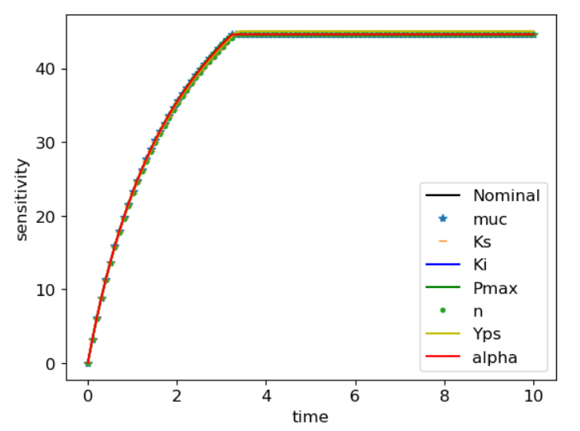
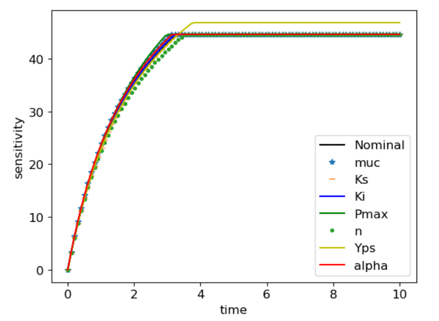

# Kinetic Modeling and Optimization of a Batch Ethanol Fermentation Process
### Samuel C Oliveira1*, Romulo C Oliveira2, Mariana V Tacin2 and Edwil AL Gattás2
This project aimed to replicate, and perhaps improve, the model developed in the above paper. The paper explores substrate limitation and inhibition by both the product ethanol and the substrate. Personal interest in this subject comes from the rising demand for fuel ethanol calls higher production and more efficient bioprocesses.The simplest models formulated to describe bioprocesses are the unstructured models. In these models, it is assumed that cellsare entities in solution that interact with the environment. Nointernal cell structure is recognized, and the cell population is treated as homogeneous. In structured models, the biomass structureis defined by means of more than one variable, which represent cellcomponents, such as the RNA content, enzymes, reactants and products.
### Differential Equations
These were my the ordinary differential equations used in the paper:

 
### Parameters
These are the parameters used for the model in this paper by authors:

 

As main objective of the paper was ethanol fermentation my main focus was on ethanol production and below i mentioned both paper fit and my fit for concentration of substrate, product and cells:

 
 
### Optimizing Parameters for a Model Fit
On fitting the data by optimizing parameters the fit looked like this and values of the new parameters (mum=1.99179776,Ks=168.48400,Ki=2.28238277,Pmax=50.697975,n=2.29167,Yps=0.3889,alpha=26.7950)

 
Overall, the resulting model was realistic, but there was room for improvement. Therefore, further analysis was completed to determine if the parameters could be narrowed down to more accurate values.
### BIfurcation analysis
To determine the stability and steady state behavior of the model, bifurcation analyses was performed. The parameter chosen for the bifuraction was alpha, as it had a good relationship with the  Product growth rate. 

To obtain a more finite result, the steady state S values were plotted as a function of alpha values. The following chart shows a more exact behavior of the bifurcation:

 

It can be seen that steady state is obtained around 44.6 and becomes stable there after.
### sensitivity analysis
To test the model's sensitivity to each parameter, an analysis of each was performed by slight perturbation of the parameter value. First, a 1% perturbation of each was tested. The resulting models were not distinct enough, therefore a 5% perturbation was tried. The following figures display the results of this analysis.

 
 

It can be seen that alpha sensitivity is very low as there is no deviation even though it depends directly in equation.
### Global sesnsitivity
 
